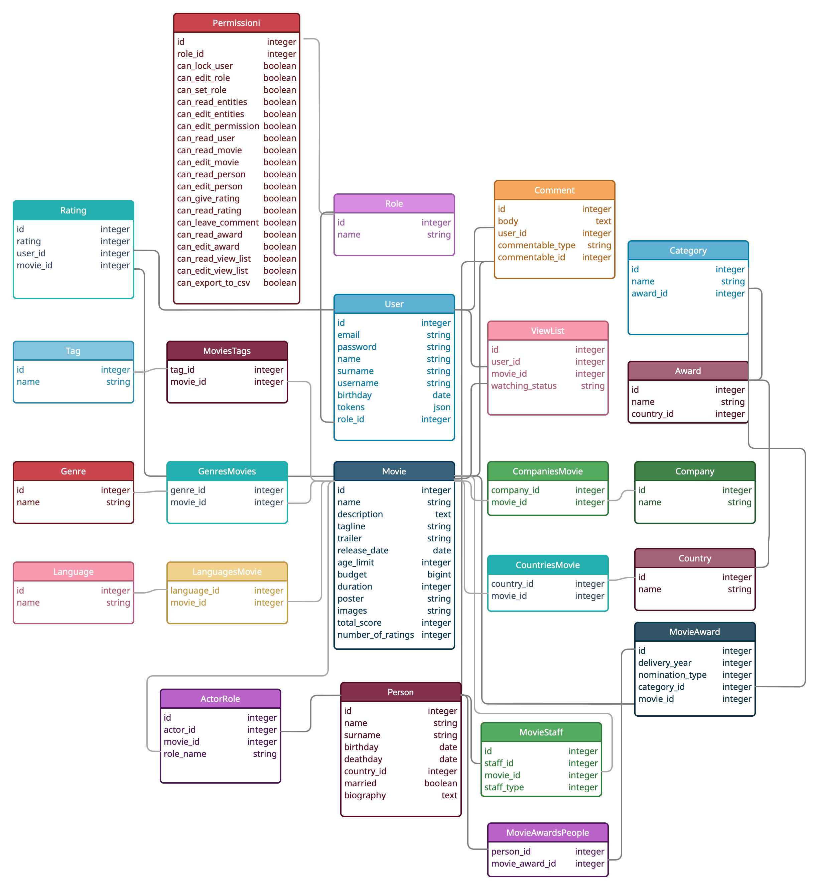

# Movie land


---
## What is our api for?

Our project is a service about films. 
It provides functionality that allows you to find out detailed information about the film,
set and find out ratings, write and watch comments, 
a list of films with the ability to set statuses, and much more.

---
## Documentation

[Swagger](https://movie-land-api-v1.herokuapp.com/api-docs/index.html)

---
## The most interesting task

Learn how to build a REST API

---
## The most difficult task

Understand the development sequence, task priority and time management

---
## What could we do if we had more time?

We could make support for series, an algorithm for selecting films according 
to the interests of the user, and a release calendar.

---
## Configuration

| Dependences | Installation |
| ------ | ------ |
| Redis | [Guide](https://redis.io/topics/quickstart) |
| Elasticsearch | [Guide](https://www.digitalocean.com/community/tutorials/how-to-install-and-configure-elasticsearch-on-ubuntu-20-04-ru) |
| Mailcatcher | [Guide](https://mailcatcher.me/) |

---

```bash
  git clone git@github.com:iTechArt-RubyLab/movie-land.git
```

```bash
  bundle install
```

```bash
  bundle exec rails db:create db:migrate db:seed
```

```bash
  bundle exec rake themoviedb
```

```bash
  bundle exec rake elasticsearch:import
```

```bash
  sudo service elasticsearch start
```

```bash
  mailcatcher
```

```bash
  redis-server
```

```bash
  sidekiq
```

```bash
  bundle exec rails s
```

---
## [Database schema](https://app.creately.com/d/jnXTTucnPpN/view)



---
### Developed by


