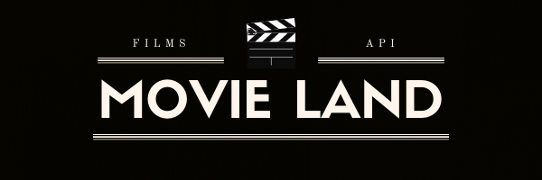

# Movie land



---
## What is our api for?

Our project is a service about films. 
It provides functionality that allows you to find out detailed information about the film,
set and find out ratings, write and watch comments, 
a list of films with the ability to set statuses, and much more.

---
## Documentation

[Swagger](https://movie-land-api-v1.herokuapp.com/api-docs/index.html)

---
## The most interesting task

Learn how to build a REST API

---
## The most difficult task

Understand the development sequence, task priority and time management

---
## What could we do if we had more time?

We could make support for series, an algorithm for selecting films according 
to the interests of the user, and a release calendar.

---
## Configuration

| Environment | Version |
| ------ | ------ |
| Ruby | 3.0.2 |
| Rails | 6.1.4 |
| Database | Postgresql |

---

| Dependencies | Installation |
| ------ | ------ |
| Redis | [Guide](https://redis.io/topics/quickstart) |
| Elasticsearch | [Guide](https://www.digitalocean.com/community/tutorials/how-to-install-and-configure-elasticsearch-on-ubuntu-20-04-ru) |
| Mailcatcher | [Guide](https://mailcatcher.me/) |

---

Clone repository

```bash
git clone git@github.com:iTechArt-RubyLab/movie-land.git
```

Run configuration commands

```bash
bundle install

rails db:create db:migrate db:seed
```

Run rake task to fill data with TheMovieDb

```bash
rake themoviedb
```

Run rake task to import data for elasticsearch

```bash
rake elasticsearch:import
```

Run configuration commands

```bash
sudo service elasticsearch start

mailcatcher

redis-server

sidekiq
```

Run rails server

```bash
rails s
```

Run all specs

```bash
rspec spec
```

---
## [Database schema](https://app.creately.com/d/jnXTTucnPpN/view)


---
### Developed by


